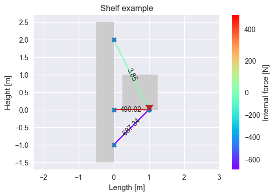
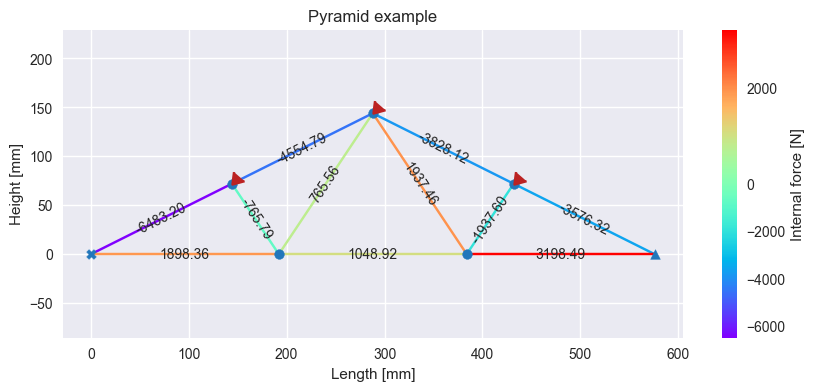
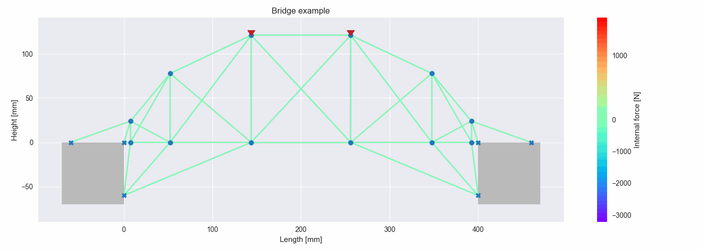

[Caio Santos, Dr](http://lattes.cnpq.br/8164040695755574). Transferências de Calor e Mecânica dos Sólidos. [Insper](https://github.com/Insper), 2022.

# 2D Static Truss Finite Element Analysis


## Introduction

Large physical systems described by differential equations tend to be subdivided into smaller, simpler parts to solve. [Finite element analysis](https://en.wikipedia.org/wiki/Finite_element_method) (FEA) software is a computer program that uses the finite element method (FEM) to solve a wide range of problems in engineering and science. This method is numerical approximation technique for solving differential equations that describe physical phenomena, such as the behavior of structures under different loads or with different materials.

This method could be applied in many fields, including structural analysis, fluid dynamics, heat transfer and electromagnetism. Some common features of finite element analysis software include the ability to:
- Model complex geometries and boundary conditions;
- Solve static, dynamic, and thermal behaviors;
- Analyze nonlinear behavior, such as material plasticity or contact;
- Import and export data from other software programs;
- Generate detailed reports and results visualizations.

### Gauss-Seidel method

The [Gauss-Seidel method](https://en.wikipedia.org/wiki/Gauss%E2%80%93Seidel_method) is an iterative method for solving systems of linear equations, which can be used in the context of finite element analysis (FEA) to solve for unknown nodal displacements in a finite element model. It is a type of relaxation method that is used to find approximate solutions to systems of equations by iteratively improving upon an initial guess.


### Beam Element

In structural engineering, a [beam element](https://en.wikipedia.org/wiki/Beam_(structure)) is a structural element that is capable of withstanding load primarily by resisting bending. Beam elements are usually straight and slender, and they are often used to construct the vertical supports of a structure, such as columns, and the horizontal members that transfer loads from the vertical supports to the foundation, such as beams and girders.

Beam elements can be made of many materials, varying concrete, steel, timber, and composite materials. They are typically designed to resist loads that are applied along their length, such as gravity, wind and earthquake loads. The strength and stiffness of beam elements are typically determined by the size, shape, and material properties.


```math
\begin{Bmatrix} 
    \bar u_1 \\
    \bar u_2
\end{Bmatrix}
=
\underbrace{
    \begin{bmatrix} 
        \cos(\theta) & \sin(\theta) & 0 & 0 \\
        0 & 0 & \cos(\theta) & \sin(\theta)
    \end{bmatrix}
}_T
\cdot
\begin{Bmatrix} 
    u_1 \\
    v_1 \\
    u_2 \\
    v_2
\end{Bmatrix}
```

```math
x=\bar u_2-\bar u_1=
\begin{bmatrix} 
    -\cos(\theta) & -\sin(\theta) & \cos(\theta) & \sin(\theta)
\end{bmatrix}
\cdot
\begin{Bmatrix} 
    u_1 \\
    v_1 \\
    u_2 \\
    v_2
\end{Bmatrix}
```

```math
\begin{Bmatrix} 
    \bar F_1 \\
    \bar F_2
\end{Bmatrix}
=
\underbrace{
    \frac{EA}{l}
    \begin{bmatrix} 
        1 & -1 \\
        -1 & 1
    \end{bmatrix}
}_{\bar K_e}
\cdot
\begin{Bmatrix} 
    \bar u_1 \\
    \bar u_2
\end{Bmatrix}
```

```math
\begin{Bmatrix} 
    F_1 \\
    F_2
\end{Bmatrix}
=
\underbrace{
    T^T\cdot\bar K_e\cdot T
}_{K_e}
\cdot
\begin{Bmatrix} 
    u_1 \\
    v_1 \\
    u_2 \\
    v_2
\end{Bmatrix}
```

```math
\bar F=K_e\cdot x
```

## Instalation
```
pip install https://github.com/FelixLuciano/2d-static-truss-fea/archive/refs/heads/master.tar.gz
```


## Examples

### Shelf



[View source](examples/shelf/source.py)

### Pyramid



[View source](examples/pyramid/source.py)

### Bridge



[View source](examples/bridge/source.py)


## Authors

<table width="100%">
    <tr>
        <td align="center">
            <a href="https://github.com/DiogoDuarteInsper"></a>
        </td>
        <td align="center">
            <a href="https://github.com/JorasOliveira"><br /></a>
        </td>
        <td align="center">
            <a href="https://github.com/FelixLuciano"><br /></a>
        </td>
    </tr>
    <tr>
        <td align="center">
            <a href="https://github.com/DiogoDuarteInsper"><strong>Diogo Duarte</strong></a>
        </td>
        <td align="center">
            <a href="https://github.com/JorasOliveira"><strong>Joras Oliveira</strong></a>
        </td>
        <td align="center">
            <a href="https://github.com/FelixLuciano"><strong>Luciano Felix</strong></a>
        </td>
    </tr>
</table>


## Competition

### Photos
<details>
<summary>Expand</summary>


</details>

## License
This project is [MIT licensed](LICENSE)!
