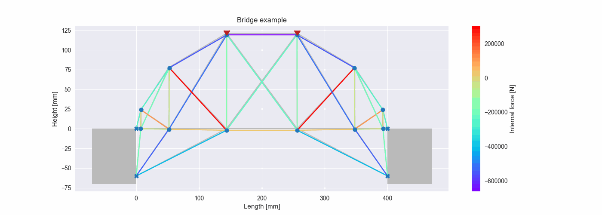

[Caio Santos, Dr](http://lattes.cnpq.br/8164040695755574). Transferências de Calor e Mecânica dos Sólidos. [Insper](https://github.com/Insper), 2022.

# 2D Static Truss Finite Element Analysis

## Introduction

A [finite element analysis](https://en.wikipedia.org/wiki/Finite_element_method) (FEA) software is a computer program that uses the finite element method (FEM) to analyze and solve problems in engineering and science. The finite element method is a numerical technique for solving differential equations that describe physical phenomena, such as the behavior of structures under load or the flow of fluids through pipes.

Finite element analysis software is used in a wide range of engineering and scientific applications, including structural analysis, fluid dynamics, heat transfer, and electromagnetics. It can be used to analyze the performance of structures under different loads, predict the behavior of materials under various conditions, and optimize designs for improved performance.

Some common features of finite element analysis software include the ability to:
- Model complex geometries and boundary conditions
- Solve for static, dynamic, and thermal behaviors
- Analyze nonlinear behavior, such as material plasticity or contact
- Import and export data from other software programs
- Generate detailed reports and visualizations of results

There are many different finite element analysis software packages available on the market, ranging from simple programs with a limited range of capabilities to more advanced packages with a wide range of features and functionality.

### Gauss-Seidel method

The [Gauss-Seidel method](https://en.wikipedia.org/wiki/Gauss%E2%80%93Seidel_method) is an iterative method for solving systems of linear equations, which can be used in the context of finite element analysis (FEA) to solve for unknown nodal displacements in a finite element model. It is a type of relaxation method that is used to find approximate solutions to systems of equations by iteratively improving upon an initial guess.

## Examples

### Bar

[View source](examples/bar.py)

### Bridge

[View source](examples/bridge.py)

## Authors

||||
|:-------------------------------------------------------:|:-------------------------------------------------------:|:-------------------------------------------------------:|
|[Diogo Duarte](https://github.com/DiogoDuarteInsper)     |[Joras Oliveira](https://github.com/JorasOliveira)       |[Luciano Felix Dias](https://github.com/FelixLuciano)    |

## License
This project is [MIT licensed](LICENSE)!
